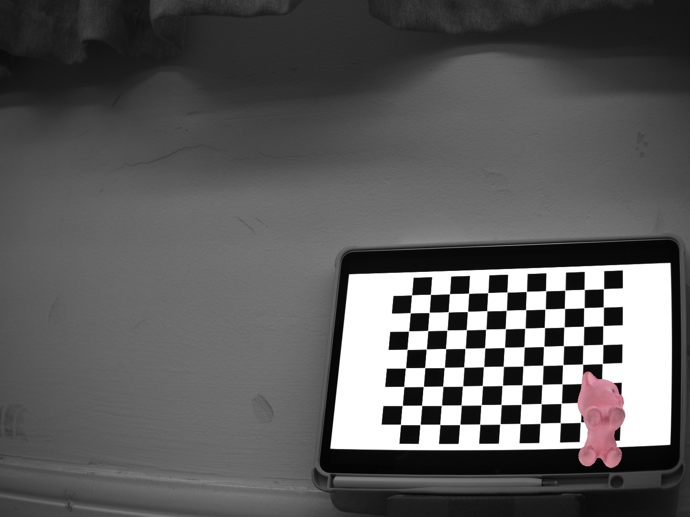
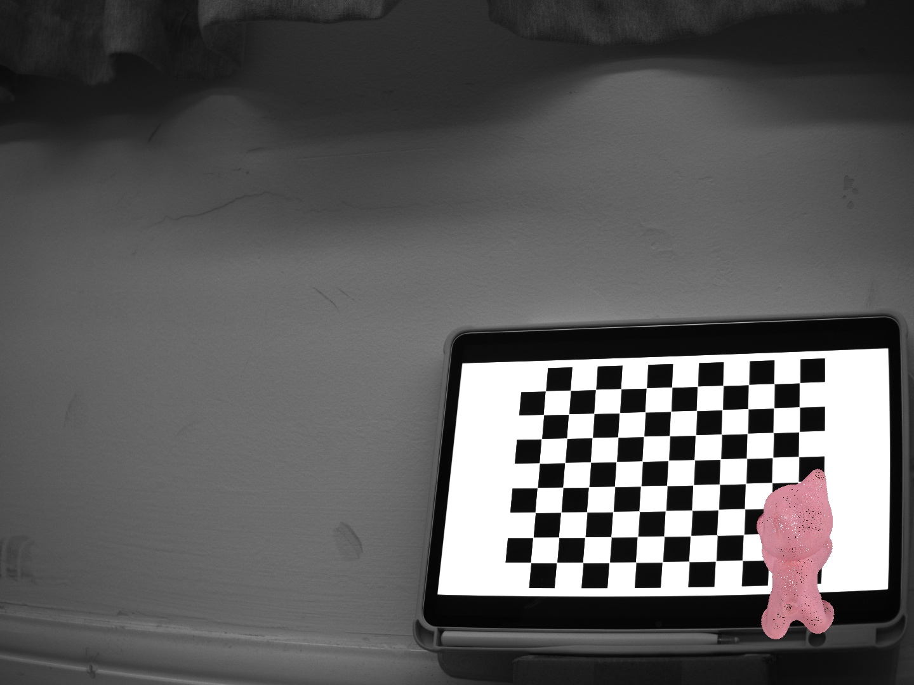

## 3.3D Points Projection

### 3.1 Introduction

The purpose of this project is to create an Augmented Reality (AR) effect by projecting a 3D item(here we choose a cat point cloud) onto a checkerboard in a 2D image. This process leverages the camera's intrinsic and extrinsic parameters, obtained from a previous calibration task, to transform and render the 3D model into the scene, thereby achieving a realistic integration of a virtual object into a real-world image.

### 3.2 Experiment Setup

The setup for this experiment involved the precise configuration of several key parameters:

* **Camera Intrinsics:** The camera matrix (focal lengths `fx`, `fy` and principal point `cx`, `cy`) and distortion coefficients were obtained from the prior camera calibration process
* **Camera Extrinsics:** The rotation matrix (`R`) and translation vector (`t`) describing the position and orientation of the checkerboard relative to the camera were also sourced from the previous calibration task.
* **3D World Coordinates:** The 3D coordinates of the checkerboard corners in the real world were defined, with the board plane set as Z=0.
* **3D Camera Center:** The 3D position of the camera's optical center was calculated using the formula `C = -R.t() * t`, which is the center of projection.
* **Point Cloud:** The 3D model to be projected was provided as a point cloud file in the shape of a cat.

### 3.3 Result and Data Processing

The initial implementation utilized OpenCV's built-in function `cv2.projectPoints` to project the 3D cat points onto the 2D image plane. The processing steps were as follows:

1. The cat point cloud and the checkerboard's 3D corners were transformed from the world coordinate system to the camera coordinate system using the extrinsic parameters `[R|t]`.
2. `cv2.projectPoints` was used to apply the camera intrinsic matrix to this transformed data, yielding the corresponding 2D pixel coordinates.
3. These 2D points were then plotted onto the original image.

However, this initial result was unsatisfactory. As shown in the image below, the projected cat appeared to be "on its back" and suffered from severe visual clutter. This occurred because the simple projection process discarded all depth (`Z`) information. Without this information, points that were farther away were drawn on top of points that should be closer to the camera, violating the fundamental principles of occlusion and leading to a confusing, non-realistic render.

*(Image: Initial projection with `cv2.projectPoints` showing the cat upside-down and with incorrect occlusion)*

To resolve this critical issue, a custom projection function was developed with the assistance of an AI model. The enhanced data processing pipeline incorporated the following key steps:

1. **Custom Projection:** A manual projection function was implemented using the formula:
   $\begin{bmatrix} u \\ v \\ 1 \end{bmatrix} = K \cdot [R | t] \cdot \begin{bmatrix} X_{world} \\ Y_{world} \\ Z_{world} \\ 1 \end{bmatrix}$
   Where `K` is the camera intrinsic matrix. The resulting homogeneous coordinates were then normalized to obtain `(u, v)` pixel coordinates.
2. **Depth-Based Occlusion (Back-face Culling):** A back-face culling mechanism was introduced. For each point of the cat in the *camera coordinate system*, its depth (`Z_camera`) was checked. Any point with a negative `Z_camera` value was deemed to be behind the camera's optical center and was therefore culled (not drawn).
3. **Painter's Algorithm with Depth Sorting:** The remaining points were sorted by their depth (`Z_camera` value) in descending order. This ensured that points farther from the camera were drawn first, and closer points were drawn on top of them, creating a correct depth-ordering effect.

The final result, after implementing this custom pipeline, showed the cat correctly oriented and positioned on the checkerboard, with proper occlusion that provided a convincing 3D illusion.

*(Image: Final AR result using the custom projection function with back-face culling and depth sorting)*

### 3.4 Analysis and Discussion

The core challenge in this project was managing depth information. The analysis is as follows:

* **Limitation of `cv2.projectPoints`:** The function `cv2.projectPoints` is designed for projecting 3D points to 2D but is agnostic to the scene's render order. It outputs 2D coordinates but does not preserve or utilize the `Z_camera` depth for visibility testing. This is why it led to a "flat" and disordered projection.

* **Importance of Back-face Culling:** The custom function's first major improvement was back-face culling. The camera's viewing frustum is defined in the positive Z-direction in the camera coordinate system. A point with a negative `Z_camera` is logically behind the camera and should be invisible. The culling condition is simple but crucial:
  $
  \text{if } Z_{camera} < 0: \text{ Cull Point}
  $
  This step immediately removed the points that caused the "upside-down" artifact, as those points, when transformed, ended up behind the camera.

* **Role of Depth Sorting:** After culling, the remaining points still needed to be drawn in the correct order. The Painter's Algorithm, while not a perfect solution for all occlusion cases, is highly effective for a single, convex-ish object like a cat model. By sorting points from farthest to nearest and drawing them in that order, we ensure that a nearer point will overwrite a farther one in the 2D image buffer, creating a correct depth perception.

### 3.5 Conclusion

In conclusion, this task successfully demonstrated the pipeline for creating an AR effect by projecting a 3D point cloud into a 2D image. The initial approach using OpenCV's `cv2.projectPoints` failed to produce a realistic result due to the loss of depth information, leading to incorrect occlusion. The problem was effectively solved by developing a custom projection function that incorporated back-face culling and depth-sorting techniques. This solution ensured that points behind the camera were discarded and that visible points were rendered with proper depth order, resulting in a coherent and visually plausible augmented reality scene. This underscores the critical importance of depth management in any 3D-to-2D projection task for computer graphics and vision.
