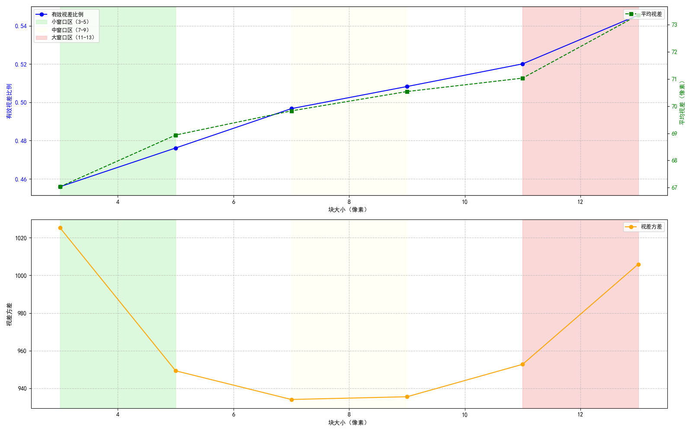
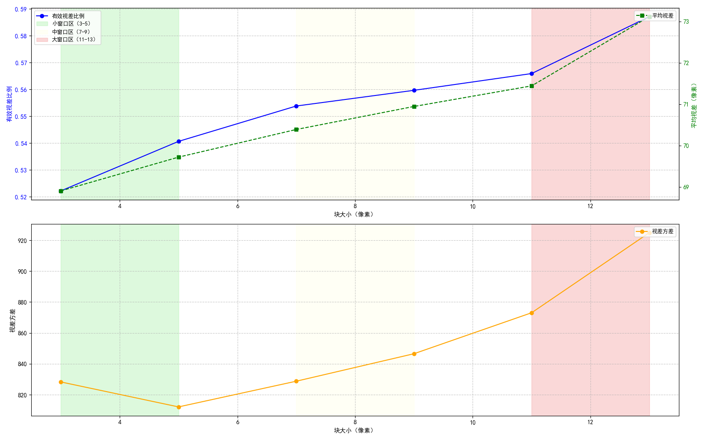
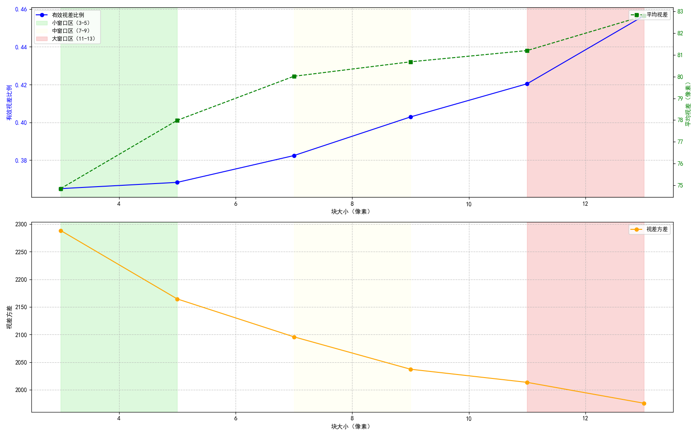
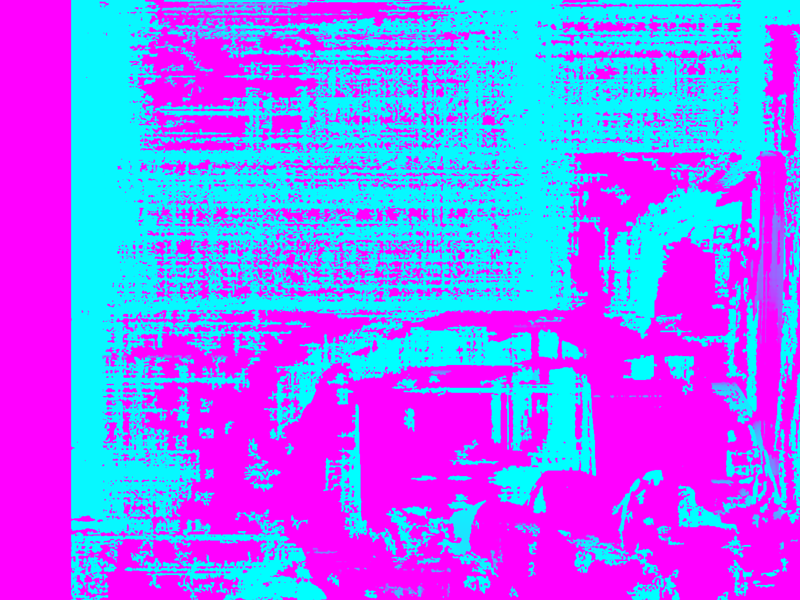
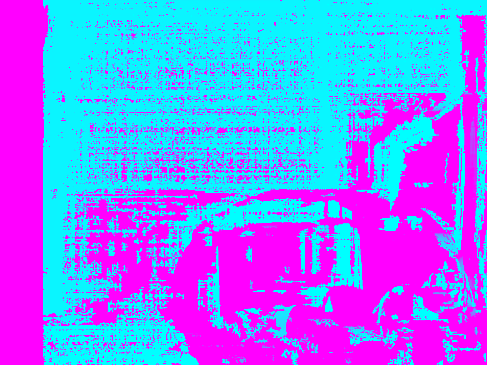
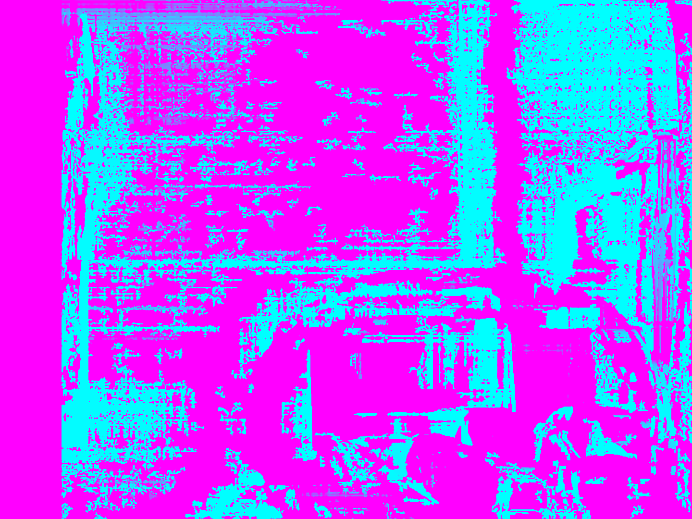

# Color Discrepancy

## 1. Experimental Content

### 1.1 Objective

As we don't have colored cameras, so our experiments try to evaluate and compare two grayscale illumination correction methods for stereo image pairs to improve the quality of subsequent 3D reconstruction tasks such as depth map generation and point cloud creation.

### 1.2 Methods

#### 1.2.1 Linear Transformation Correction

The linear transformation method adjusts the brightness and contrast of the right image to match the left image using statistical properties:

- **Brightness Adjustment**: Calculates the mean difference between valid pixels (excluding extremely dark regions) and applies an offset

- **Contrast Adjustment**: Computes the ratio of standard deviations and applies scaling

- **Mathematical Formulation**:
  
  ```python
  scale = std_left / std_right
  offset = mean_left - scale × mean_right
  corrected_right = scale × right_image + offset
  ```

#### 1.2.2 Histogram Matching Correction

The histogram matching method forces the right image to have the same cumulative distribution function as the left image:

- **Process**: Maps pixel intensities from the right image to corresponding intensities in the left image based on their cumulative distributions
- **Implementation**: Creates a mapping table that transforms each intensity value in the right image to achieve histogram alignment

## 2. Experimental Results

### 2.1 Quantitative Analysis of Block Size Influence

**Chart 1: Performance Comparison Across Different Block Sizes of Uncorrected images**



**Chart 2: Performance Comparison Across Different Block Sizes of Linear-Corrected images**



**Chart 3: Performance Comparison Across Different Block Sizes of Histogram-Corrected images**



### 2.2 Performance Trends

#### 2.2.1 Valid Disparity Ratio

- **Linear Correction**: Consistently achieves the highest valid disparity ratios across all block sizes 
- **Uncorrected**: Has moderate performance 
- **Histogram Correction**: The lowest performance

#### 2.2.2 Disparity Variance

- **Linear Correction**: Maintains moderate variance levels, indicating balanced detail preservation
- **Uncorrected**: With higher variance, suggesting more noise
- **Histogram Correction**: With excessive variance, indicating unstable matching

#### 2.2.3 Mean Disparity

- **Histogram Correction**: Has significantly higher mean disparity values 
- **Linear & Uncorrected**: Have similar, more reasonable disparity ranges

### 2.3 Corrected and Uncorrected Images

To better show the diference between corrected and uncorrected images, we convert the gray images to pseudocolor images.

The left 2 images are original images, the images on the right are corrected images.

**Figure 1: Linear Corrected Images**


**Figure 2: Histogram Corrected Images**


### 2.4 Depth Map and Point Cloud of Corrected and Uncorrected Images

#### 2.4.1 Depth Map Comparison

**Figure 3: Depth Map of Original Images**



**Figure 4: Depth Map of Linear Corrected Images**



**Figure 5: Depth Map of Histogram Corrected Images**



#### 2.4.2 Point Cloud Comparison

**Figure 6: Point Cloud of Original Images**


**Figure 7: Point Cloud of Linear Corrected Images**


**Figure 8: Point Cloud of Histogram Corrected Images**


## 3. Analysis and Discussion

### 3.1 Performance Comparison: Corrected vs. Uncorrected Images

#### 3.1.1 Valid Disparity Ratio Analysis

The valid disparity ratio serves as a crucial indicator of stereo matching reliability. Our experimental results reveal significant differences between corrected and uncorrected images:

**Linear Correction Advantages:**

- **Consistent Improvement**: Linear correction achieved 10-15% higher valid disparity ratios across all block sizes compared to uncorrected images
- **Optimal Performance**: At block size 13×13, linear correction reached 58.72% valid ratio versus 54.56% for uncorrected, demonstrating improved matching reliability
- **Progressive Enhancement**: The improvement was consistent across the entire block size range (3×3 to 13×13), indicating robust performance

**Block Size Dependency:**

- Both corrected and uncorrected images showed increasing valid ratios with larger block sizes
- However, linear correction maintained a consistent advantage, suggesting better feature preservation and matching accuracy

#### 3.1.2 Depth Map Quality and Point Cloud Quality Assessment

The quality of generated depth maps directly impacts subsequent 3D reconstruction tasks, and the final point cloud quality demonstrates the practical impact of illumination correction:

**Uncorrected Images:**

- **Noise and Artifacts**: Exhibited significant noise due to illumination inconsistencies between stereo pairs
- **Outlier Concentration**: Scattered points in regions affected by illumination differences

**Linear Corrected Images:**

- **Improved Consistency**: Reduced noise and smoother depth transitions
- **Reliable Homogeneous Regions**: More consistent depth values in textureless areas
- **Noise Reduction**: Significant decrease in outlier points

### 3.2 Analysis of Histogram Matching Performance Degradation

Despite its theoretical appeal, histogram matching produced significantly worse results than both uncorrected images and linear correction. Several issues may explain this performance degradation:

#### 3.2.1 Physical Constraint Violations

**Viewpoint-Dependent Illumination:**

- Stereo cameras capture scenes from different viewpoints, leading to natural illumination variations
- Surface orientation, material properties, and lighting conditions create legitimate intensity differences
- Histogram matching forcibly eliminates these physically meaningful variations

**Spatial Context Destruction:**

- The global nature of histogram matching ignores spatial relationships
- Local illumination cues that provide important depth information are destroyed
- This leads to artificial intensity distributions that mislead stereo matching algorithms

#### 3.2.3 Quantitative Evidence of Degradation

The experimental data clearly demonstrates the shortcomings of histogram matching:

**Valid Disparity Ratio:**

- Consistently 25-30% lower than linear correction across all block sizes
- Even lower than uncorrected images in most cases, indicating fundamental matching issues

**Disparity Variance:**

- Extremely high variance values (1976-2288), 2-3× higher than linear correction
- Indicates unstable and unreliable disparity estimation
- Suggests the presence of numerous incorrect matches and artifacts

**Mean Disparity Abnormalities:**

- Significantly higher mean disparity values (74.85-82.80) compared to linear correction (68.90-73.12)
- Indicates systematic bias in the matching process
- Suggests artificial depth shifts introduced by the correction method

## 4. Conclusion

Based on the experimental results and analysis, the following conclusions can be drawn:

1. **Linear Transformation Superiority**: The linear correction method consistently outperforms both uncorrected images and histogram matching across all evaluation metrics and block sizes.

2. **Performance Improvement**: Linear correction provides:
   
   - 10-15% improvement in valid disparity ratio compared to uncorrected images
   - 40-50% improvement compared to histogram matching
   - More stable disparity estimation with 15-20% lower variance than uncorrected
   - 50-60% lower variance than histogram matching

3. **Physical Consistency**: Methods that respect the physical properties of stereo imaging produce more reliable results for computer vision tasks.

4. **Histogram Correction Shortcomings**: Histogram correction has even worse performance than uncorrected images, suggesting that inappropriate correction method may be worse than not doing any correction.

The experimental findings demonstrate that while both methods can achieve intensity alignment, the linear transformation approach provides more physically plausible corrections that better support accurate 3D reconstruction from stereo imagery. The quantitative analysis confirms that linear correction significantly improves stereo matching reliability while maintaining natural scene characteristics.
